> 别人的测试版本
>
> Springboot: 2.1.7.RELEASE
>
> SpringCloud: Greenwich.SR2

# Spring Cloud

## 微服务（Microservices）

 是一种架构风格，一个大型复杂软件应用由一个或多个微服务组成。系统中的各个微服务可被独立部署，各个微服务之间是松耦合的。每个微服务仅关注于完成一件任务并很好地完成该任务。在所有情况下，每个任务代表着一个小的业务能力。

## Dubbo

Dubbo是一个分布式服务框架，致力于提供高性能和透明化的 RPC 远程服务调用方案，以及 SOA 服务治理方案。简单的说，Dubbo 就是个服务框架，说白了就是个远程服务调用的分布式框架。

## Spring Cloud

springcloud是一整套的微服务解决方案

**dubbo和springcloud功能对比：**

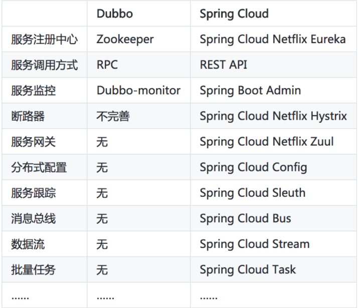


## Spring Cloud 常用组件

- **Spring Cloud Config 配置中心：** 利用 Git 集中管理程序的配置。
- **Spring Cloud Netflix Eureka：** 服务中心（类似于管家的概念，需要什么直接从这里取，就可以了），一个基于 REST 的服务，用于定位服务，以实现云端中间层服务发现和故障转移。
- **Spring Cloud Netflix Hystrix 熔断器：** 容错管理工具，旨在通过熔断机制控制服务和第三方库的节点，从而对延迟和故障提供更强大的容错能力。
- **Spring Cloud Netflix Zuul 网关：** 是在云平台上提供动态路由，监控，弹性，安全等边缘服务的框架。Web 网站后端所有请求的前门。
- **Spring Cloud Netflix Archaius：** 配置管理 API，包含一系列配置管理API，提供动态类型化属性、线程安全配置操作、轮询框架、回调机制等功能。
- **Spring Cloud Netflix Ribbon：** 负载均衡。
- **Spring Cloud Netflix Fegin：** REST客户端。
- **Spring Cloud Bus：** 消息总线，利用分布式消息将服务和服务实例连接在一起，用于在一个集群中传播状态的变化。
- **Spring Cloud Security：** 安全控制。
- **Spring Cloud Sleuth：** 分布式链路监控，SpringCloud 应用的分布式追踪系统，和 Zipkin，HTrace，ELK 兼容。
- **Spring Cloud Stream：** 消息组件，基于 Redis，Rabbit，Kafka 实现的消息微服务，简单声明模型用以在 Spring Cloud 应用中收发消息。

# Eureka 服务注册与发现中心

## Eureka 介绍

Eureka由两个组件组成：Eureka服务器和Eureka客户端。Eureka服务器用作服务注册服务器。Eureka客户端是一个java客户端，**用来简化与服务器的交互、作为轮询负载均衡器，并提供服务的故障切换支持。Netflix在其生产环境中使用的是另外的客户端，它提供基于流量、资源利用率以及出错状态的加权负载均衡。**

简单来说，分为三部分

1、Eureka Server

​	提供服务注册和发现

2、Service Provider

​	服务提供方

​	将自身服务注册到Eureka，从而使服务消费方能够找到
3、Service Consumer

​	服务消费方

​	从Eureka获取注册服务列表，从而能够消费服务


将producer注册到服务端，consumer就可以使用了

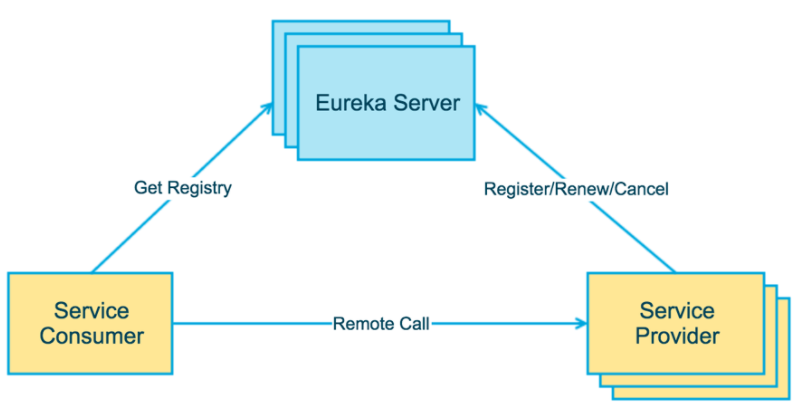


## demo 代码

**各个部份使用时候，有不同的注解，不同依赖，各个部分的配置也不尽相同，**这是成功的重点

```
//服务
@EnableEurekaServer

//producer来将服务注册到服务中心
@EnableEurekaClient

//消费时，使用Feign客户端，具体看代码
@EnableEurekaClient
@EnableFeignClients
```

顺次启动eureka、producer、consumer三个项目即可

再次启动producer2 实现默认的轮询负载均衡

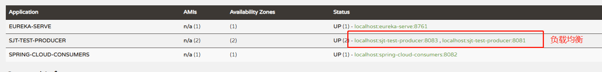

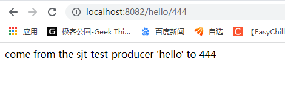

刷新页面


# Hystrix 熔断器

## 熔断器

服务雪崩

在正常的微服务架构体系下，一个业务很少有只需要调用一个服务就可以返回数据的情况，这种比较常见的是出现在demo中，一般都是存在调用链的，比如A->B->C->D，如果D在某一个瞬间出现问题，比如网络波动，io偏高，导致卡顿，随着时间的流逝，后续的流量继续请求，会造成D的压力上升，有可能引起宕机。

你以为这就是结束么，图样图森破，这才是噩梦的开始，在同一个调用链上的ABC三个服务都会随着D的宕机而引发宕机，这还不是结束，一个服务不可能只有一个接口，当它开始卡顿宕机时，会影响到其他调用链的正常调用，最终导致所有的服务瘫痪。

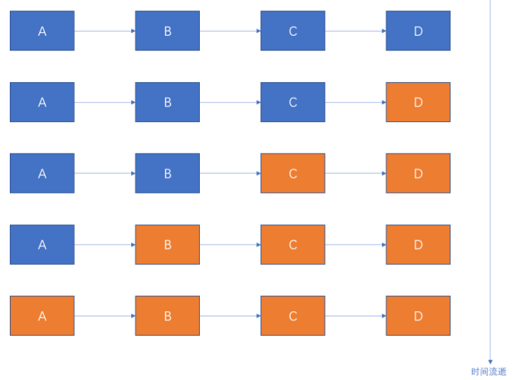

相信大家都知道家用电闸，原来老式的电闸是使用保险丝的（现在很多都是空气开关了），当家里用电量过大的时候，保险丝经常烧断，这么做是保护家里的用电器，防止过载。

熔断器的作用和这个很像，它可以实现快速失败，如果在一段时间内服务调用失败或者异常，会强制要求当前调用失败，不在走远程调用，走**服务降级**操作（返回固定数据或者其他一些降级操作）。从而防止应用程序不断地尝试执行可能会失败的操作，使得应用程序继续执行而不用等待修正错误，或者浪费CPU时间去等到长时间的超时产生。熔断器也可以自动诊断错误是否已经修正，如果已经修正，应用程序会再次尝试调用操作。

熔断器模式就像是那些容易导致错误的操作的一种代理。这种代理能够记录最近调用发生错误的次数，然后决定使用允许操作继续，或者立即返回错误。 Hystrix会有一个熔断时间窗口，具体转换逻辑如下：

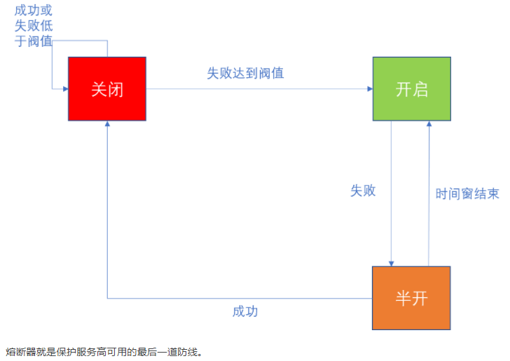

## Hystrix

**断路器机制**

断路器很好理解, 当Hystrix Command请求后端服务失败数量超过一定比例(默认50%), 断路器会切换到开路状态(Open)。这时所有请求会直接失败而不会发送到后端服务。断路器保持在开路状态一段时间后(默认5秒), 自动切换到半开路状态(HALF-OPEN)。这时会判断下一次请求的返回情况, 如果请求成功, 断路器切回闭路状态(CLOSED), 否则重新切换到开路状态(OPEN)。Hystrix的断路器就像我们家庭电路中的保险丝, 一旦后端服务不可用, 断路器会直接切断请求链, 避免发送大量无效请求影响系统吞吐量, 并且断路器有自我检测并恢复的能力。

**Fallback**

Fallback相当于是降级操作。对于查询操作, 我们可以实现一个fallback方法, 当请求后端服务出现异常的时候, 可以使用fallback方法返回的值。fallback方法的返回值一般是设置的默认值或者来自缓存。

**资源隔离**

在Hystrix中, 主要通过线程池来实现资源隔离。通常在使用的时候我们会根据调用的远程服务划分出多个线程池。例如调用产品服务的Command放入A线程池, 调用账户服务的Command放入B线程池。这样做的主要优点是运行环境被隔离开了。这样就算调用服务的代码存在bug或者由于其他原因导致自己所在线程池被耗尽时, 不会对系统的其他服务造成影响。但是带来的代价就是维护多个线程池会对系统带来额外的性能开销。如果是对性能有严格要求而且确信自己调用服务的客户端代码不会出问题的话, 可以使用Hystrix的信号模式(Semaphores)来隔离资源。

## Feign Hystrix

前面我们使用了producer和consumers，**熔断器是只作用在服务调用端，即consumer**，因此上一篇使用到的consumers我们可以直接拿来使用。

因为，**Feign中已经依赖了Hystrix**所以在maven配置上不用做任何改动。

只需要新增如下配置，即可开始使用

```
#spring cloud 2020版本之后使用
feign:
  circuitbreaker:
    enabled: true

#spring cloud 2020版本之前使用 feign.hystrix.enabled = true
feign:
  hystrix:
    enabled: true
```

## demo 代码

直接在原来的项目中

在consumer端添加配置

```java
feign:
  hystrix:
    enabled: true
        
新增依赖：
         <dependency>
            <groupId>org.springframework.cloud</groupId>
            <artifactId>spring-cloud-starter-netflix-hystrix</artifactId>
            <version>2.2.6.RELEASE</version>
        </dependency>
```

新增熔断的方法，fallback

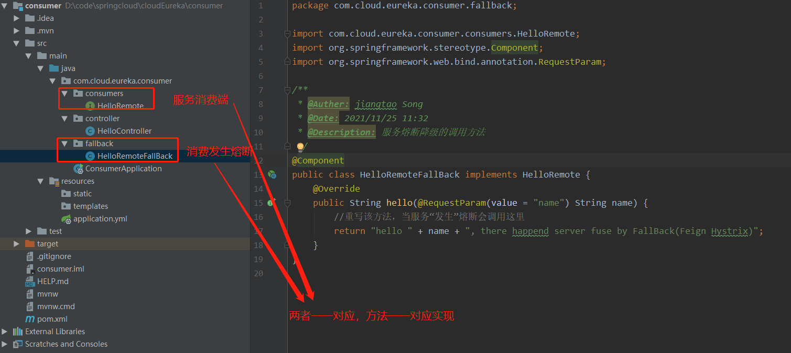

新增fallback，即熔断以后去找谁

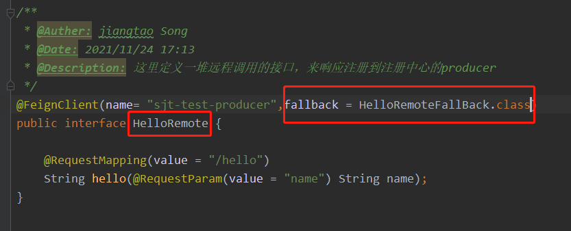


手动把provider停掉，来”人为构造“熔断


# Config 配置中心

Spring Cloud Config项目是一个解决分布式系统的配置管理方案。它包含了Client和Server两个部分，server提供配置文件的存储、以接口的形式将配置文件的内容提供出去，client通过接口获取数据、并依据此数据初始化自己的应用。Spring cloud使用git或svn存放配置文件，默认情况下使用git


这套配置中心，有一个服务端，有一个客户端

服务端用来存储配置文件

客户端用来使用配置文件


## 服务端

引入相关的依赖

```
   <dependency>
       <groupId>org.springframework.cloud</groupId>
       <artifactId>spring-cloud-config-server</artifactId>
   </dependency>
```

配置文件

```
server:
  port: 8080
spring:
  application:
    name: spring-cloud-config-server
  cloud:
    config:
      server:
        git:
          uri: https://github.com/xxxxx # git仓库的地址
          search-paths: chapter6/springcloud-config  # git仓库地址下的相对地址，可以配置多个，用,分割。
          username: #Git仓库用户名
          password: #Git仓库密码
```

启动类 新增注解@EnableConfigServer 启动项目，就相当于发布了配置中心服务


然后就可以使用了

## 客户端

引入相关的依赖

```
   <dependency>
       <groupId>org.springframework.cloud</groupId>
       <artifactId>spring-cloud-config-server</artifactId>
   </dependency>
```

配置文件

```
# application.yml如下：

server:
  port: 8081
spring:
  application:
    name: spring-cloud-config-client

# bootstrap.properties如下：

spring.cloud.config.name=springcloud-config
spring.cloud.config.profile=dev
spring.cloud.config.uri=http://localhost:8080/
spring.cloud.config.label=master
```

- spring.application.name：对应{application}部分
- spring.cloud.config.profile：对应{profile}部分
- spring.cloud.config.label：对应git的分支。如果配置中心使用的是本地存储，则该参数无用
- spring.cloud.config.uri：配置中心的具体地址
- spring.cloud.config.discovery.service-id：指定配置中心的service-id，便于扩展为高可用配置集群。

> 注意：上面这些与spring-cloud相关的属性必须配置在bootstrap.properties中，config部分内容才能被正确加载。因为config的相关配置会先于application.properties，而bootstrap.properties的加载也是先于application.yml。

启动类只需@SpringBootApplication 即可使用


通过  @Value("${springcloud.hello}")，访问对应配置文件中的属性即可


## 高可用，即时刷新

高可用可以通过，将 config 服务当成一个provider发布到注册中心 eureka中，多发布几个节点，即可

即时刷新，config这一块做的还是比较臃肿的，**nacos**还是不错的选择


# Zuul Api网关

## 概述

api调用网关

> 在Spring Cloud微服务系统中，一种常见的负载均衡方式是，客户端的请求首先经过负载均衡（zuul、Ngnix、F5），再到达服务网关（zuul集群），然后再到具体的服务，服务统一注册到高可用的服务注册中心集群，服务的所有的配置文件由配置服务管理，配置服务的配置文件放在git仓库，方便开发人员随时改配置。

作用：

- 同一接口调用，简化服务端的内部逻辑
- 多渠道支持，web端，移动端，云端，调用都可协调
- 鉴权
- 流量转发、过滤；
- 负载均衡
- 请求统计

## 使用

使用起来也很简单

1、引入依赖

```
  <dependency>
      <groupId>org.springframework.cloud</groupId>
      <artifactId>spring-cloud-starter-netflix-zuul</artifactId>
  </dependency>
```

2、配置文件

```
server:
  port: 8080
spring:
  application:
    name: spring-cloud-zuul
zuul:
  routes:
    baidu:
      path: /baidu/**
      url: https://www.baidu.com/
```

如果直接访问http://localhost:8080/baidu，则会直接跳转到https://www.baidu.com/。

3、启动类新增注解：@EnableZuulProxy 开启即可使用

## 服务化

通过eureka注册中心来进行服务化，

1、新增依赖

```
<dependency>
  <groupId>org.springframework.cloud</groupId>
  <artifactId>spring-cloud-starter-netflix-eureka-client</artifactId>
</dependency>
```

2、配置文件

```
server:
  port: 8080
spring:
  application:
    name: spring-cloud-zuul
zuul:
  routes:
    api-producer:
      path: /asdfasaasdfasdfffa/**
      serviceId: SJT-TEST-PRODUCER
eureka:
  client:
    service-url:
      defaultZone: http://localhost:8761/eureka/
```

这样我们访问：http://localhost:8080/asdfasaasdfasdfffa/hello?name=spring，即可实现对producer里面注册的服务调用


## zuul 过滤器

Zuul的核心是Filter，用来实现对外服务的控制。分别是“PRE”、“ROUTING”、“POST”、“ERROR”，整个生命周期可以用下图来表示。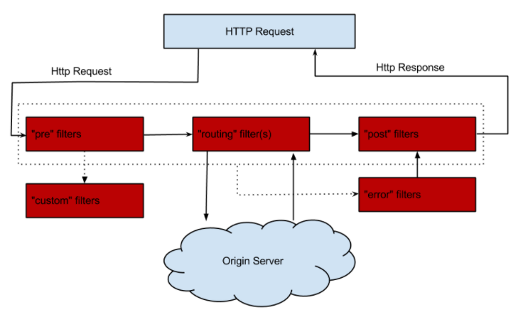

- **PRE：** 这种过滤器在请求被路由之前调用。我们可利用这种过滤器实现**身份验证**、在集群中选择请求的微服务、**记录调试信息**等。
- **ROUTING：** 这种过滤器将请求路由到微服务。这种过滤器用于构建发送给微服务的请求，并使用Apache HttpClient或Netfilx Ribbon请求微服务。
- **POST：** 这种过滤器在路由到微服务以后执行。这种过滤器可用来为响应添加标准的HTTP Header、收集统计信息和指标、将响应从微服务发送给客户端等。
- **ERROR：** 在其他阶段发生错误时执行该过滤器。

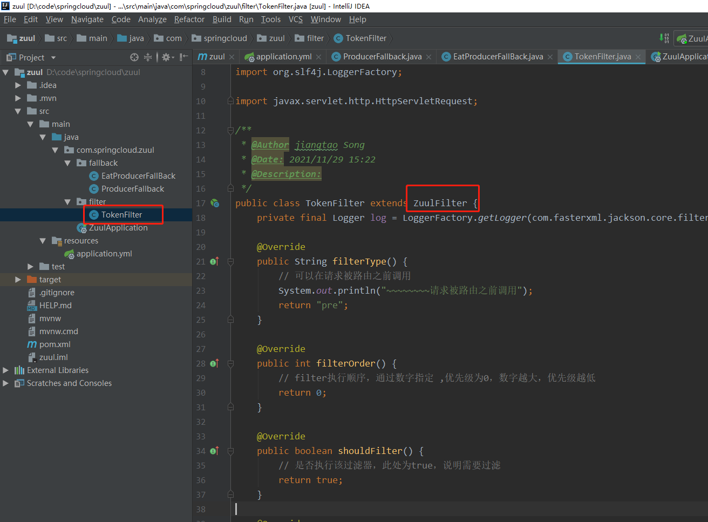

启动类注册：

```
 @Bean
    public TokenFilter tokenFilter() {
        return new TokenFilter();
    }
```

测试 http://localhost:8084/sjt-test-producer/hello?name=123&token=123


测试 ：http://localhost:8084/sjt-test-producer/hello?name=123

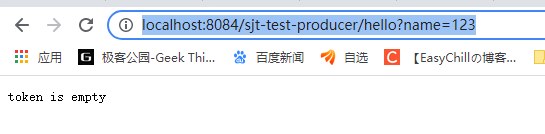

## zuul的熔断器

这里熔断器和消费端的熔断器，概念意义上是一个东西，但是实现起来不同

在zuul中调用producer实现

```()
getRoute() 指明熔断拦截哪个服务
fallbackResponse() 定制返回内容
```

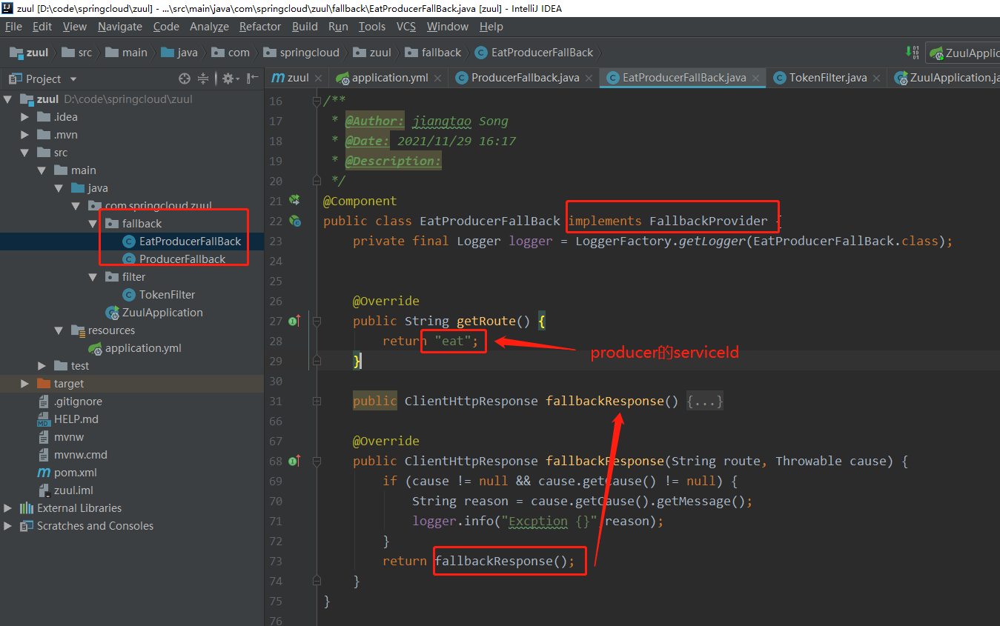


将Eureka的自我保护模式打开，如果这里不开启自我保护模式，producer一停止服务，这个服务直接在Eureka下线，Zuul会直接报错找不到对应的producer服务。

在eureka服务中，修改配置文件

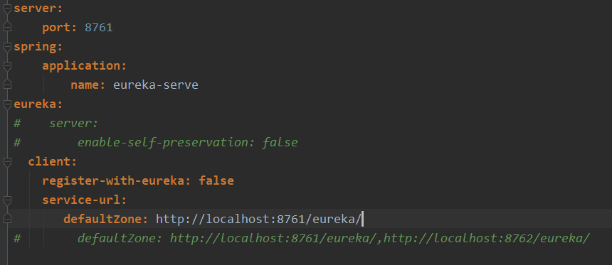


手动停止producer，访问：http://localhost:8084/sjt-test-producer/hello?name=123&token=123，zuul端服务成功熔断

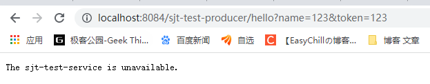

## Sleuth和Zipkin 分布式链路跟踪

在分布式服务架构中，需要对分布式服务进行治理

在分布式服务协同向用户提供服务时，每个请求都被哪些服务处理？

在遇到问题时，在调用哪个服务上发生了问题？

在分析性能时，调用各个服务都花了多长时间？哪些调用可以并行执行？

…… 为此，分布式服务平台就需要提供这样一种基础服务

即可以**记录每个请求的调用链；调用链上调用每个服务的时间；各个服务之间的拓扑关系**…… 我们把这种行为称为“**分布式服务跟踪**”。


使用最为广泛的开源实现是 Twitter 的 Zipkin，为了实现平台无关、厂商无关的分布式服务跟踪，CNCF 发布了布式服务跟踪标准 Open Tracing。国内，淘宝的“鹰眼”、京东的“Hydra”、大众点评的“CAT”、新浪的“Watchman”、唯品会的“Microscope”、窝窝网的“Tracing”都是这样的系统。


# Gateway Api网关

引入相关的依赖，即可使用，详见代码

```
server:
  port: 8086
spring:
  application:
    name: api-gateway
  cloud:
    gateway:
      routes:
      # 配置多条
#        - id: gateway-service-sjt
#          uri: https://blog.csdn.net/Song_JiangTao
#          order: 0
#          predicates:
#            - Cookie=sessionId, sjt
        - id: gateway-service
          uri: https://www.baidu.com
          order: 0
          predicates:
#在配置时间之前访问，之后访问，区间访问 http://localhost:8086/ 满足则跳百度，否则404
#            - Before=2019-01-01T00:00:00+08:00[Asia/Shanghai]
#            - After=2019-01-01T00:00:00+08:00[Asia/Shanghai]
#            - Between=2019-01-01T00:00:00+08:00[Asia/Shanghai], 2030-07-01T00:00:00+08:00[Asia/Shanghai]

#cookie和header匹配路径，格式：key,value;value可以是关键字
#              - Cookie=sessionId, test
#              - Header=h, \d+
#请求方法
#              - Method=GET
              - Path=/sjt/{segment}, /sjt2/{segment}
#              - RemoteAddr=192.168.1.1/24
#              - Query=smile

#上述匹配均可随意组合使用
```


## 服务化

```
<dependency>
  <groupId>org.springframework.cloud</groupId>
  <artifactId>spring-cloud-starter-netflix-eureka-client</artifactId>
</dependency>
```

启动类

```
@EnableEurekaClient
```

即可将网关注册为服务

之后上面的配置即可简化为，

```
server:
  port: 8086
eureka:
  client:
    service-url:
      defaultZone: http://localhost:8761/eureka/
logging:
  level:
    org.springframework.cloud.gateway: debug
spring:
  application:
    name: api-gateway
  cloud:
    gateway:
    #discovery:locator:enabled 代表开启与服务注册于发现组件进行结合
    #通过 serviceId 转发到具体的服务实例。默认为 false，设为 true 便开启通过服务中心的自动根据 serviceId 创建路由的功能。
      discovery:
        locator:
          enabled: true
          #serviceID 小写访问开启，默认得大写访问
          lowerCaseServiceId: true
```

routes下面的自定义路由即可 由 上述配置默认取代

同样，基于eureka的负载均衡，启动多个同一serviceID的服务，即可通过网关实现负载，无需做其他操作


## 限流

限速在高并发场景中比较常用的手段之一，可以有效的保障服务的整体稳定性，Spring Cloud Gateway 提供了基于 Redis 的限流方案。所以我们首先需要添加对应的依赖包spring-boot-starter-data-redis-reactive

```xml
<dependency>
  <groupId>org.springframework.boot</groupId>
  <artifactId>spring-boot-starter-data-redis-reactive</artifactId>
</dependency>COPY
```

配置文件中需要添加 Redis 地址和限流的相关配置

```yaml
server:
  port: 8080
spring:
  application:
    name: spring-cloud-gateway
  redis:
    host: localhost
    password: password
    port: 6379
  cloud:
    gateway:
      discovery:
        locator:
          enabled: true
      routes:
        - id: requestratelimiter_route
          uri: http://example.org
          filters:
            - name: RequestRateLimiter
              args:
                redis-rate-limiter.replenishRate: 10
                redis-rate-limiter.burstCapacity: 20
                key-resolver: "#{@userKeyResolver}"
          predicates:
            - Method=GETCOPY
```

- filter 名称必须是 RequestRateLimiter
- redis-rate-limiter.replenishRate：允许用户每秒处理多少个请求
- redis-rate-limiter.burstCapacity：令牌桶的容量，允许在一秒钟内完成的最大请求数
- key-resolver：使用 SpEL 按名称引用 bean

项目中设置限流的策略，创建 Config 类。

```java
package com.springcloud.gateway.config;

import org.springframework.cloud.gateway.filter.ratelimit.KeyResolver;
import org.springframework.context.annotation.Bean;
import org.springframework.context.annotation.Configuration;
import reactor.core.publisher.Mono;

@Configuration
public class Config {
    @Bean
    KeyResolver userKeyResolver() {
        return exchange -> Mono.just(exchange.getRequest().getQueryParams().getFirst("user"));
    }
}
COPY
```

Config类需要加@Configuration注解。

根据请求参数中的 user 字段来限流，也可以设置根据请求 IP 地址来限流，设置如下:

```java
@Bean
public KeyResolver ipKeyResolver() {
    return exchange -> Mono.just(exchange.getRequest().getRemoteAddress().getHostName());
}COPY
```

这样网关就可以根据不同策略来对请求进行限流了。


## 熔断

Spring Cloud Gateway 也可以利用 Hystrix 的熔断特性，在流量过大时进行服务降级，同样我们还是首先给项目添加上依赖。

```xml
<dependency>
  <groupId>org.springframework.cloud</groupId>
  <artifactId>spring-cloud-starter-netflix-hystrix</artifactId>
</dependency>COPY
```

配置示例

```yaml
spring:
  cloud:
    gateway:
      routes:
      - id: hystrix_route
        uri: http://example.org
        filters:
        - Hystrix=myCommandNameCOPY
```

配置后，gateway 将使用 myCommandName 作为名称生成 HystrixCommand 对象来进行熔断管理。如果想添加熔断后的回调内容，需要在添加一些配置。

```yaml
spring:
  cloud:
    gateway:
      routes:
      - id: hystrix_route
        uri: lb://spring-cloud-producer
        predicates:
        - Path=/consumingserviceendpoint
        filters:
        - name: Hystrix
          args:
            name: fallbackcmd
            fallbackUri: forward:/incaseoffailureusethisCOPY
```

fallbackUri: forward:/incaseoffailureusethis配置了 fallback 时要会调的路径，当调用 Hystrix 的 fallback 被调用时，请求将转发到/incaseoffailureuset这个 URI。

## 重试

RetryGatewayFilter 是 Spring Cloud Gateway 对请求重试提供的一个 GatewayFilter Factory。

配置示例

```yaml
spring:
  cloud:
    gateway:
      routes:
      - id: retry_test
        uri: lb://spring-cloud-producer
        predicates:
        - Path=/retry
        filters:
        - name: Retry
          args:
            retries: 3
            statuses: BAD_GATEWAYCOPY
```

Retry GatewayFilter 通过这四个参数来控制重试机制： retries, statuses, methods, 和 series。

- retries：重试次数，默认值是 3 次
- statuses：HTTP 的状态返回码，取值请参考：org.springframework.http.HttpStatus
- methods：指定哪些方法的请求需要进行重试逻辑，默认值是 GET 方法，取值参考：org.springframework.http.HttpMethod
- series：一些列的状态码配置，取值参考：org.springframework.http.HttpStatus.Series。符合的某段状态码才会进行重试逻辑，默认值是 SERVER_ERROR，值是 5，也就是 5XX(5 开头的状态码)，共有5 个值。

以上便是项目中常用的一些网关操作，更多关于 Spring Cloud GateWay 的使用请参考官网。


## Skywalking 分布式链路追踪功能

Skywalking 提供**分布式追踪、服务网格遥测分析、度量聚合和可视化**一体化解决方案。

官方对自己介绍是专为微服务，云原生和基于容器（Docker，Kubernetes，Mesos）架构而设计。

### Skywalking 架构

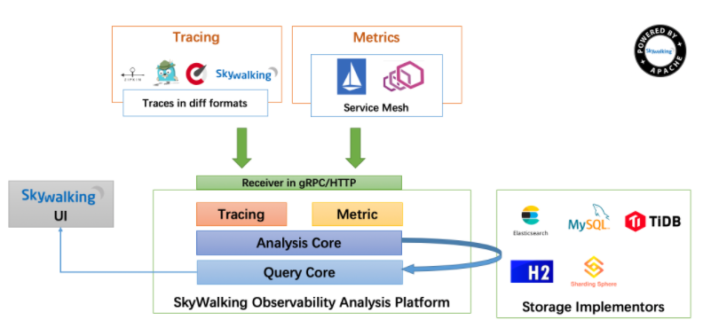

Skywalking总体由四个部分`agent`、`collector`、`webapp-ui`、`storage`组成。图从上到下是应用层接入，可以使用无入侵性的`agent`探针接入，通过HTTP或者gRPC讲数据发送至Skywalking分析平台`collector`，`collector`对接受到的数据进行聚合分析，最后存储至`storage`中，这里支持多种存储方式，比较常用的有H2和ElasticSearch，最后可以由`webapp-ui`对所有的数据进行展示。

### Spring Cloud与Skywalking实战

#### Skywalking部署构建

在介绍实战之前，我们先简单介绍一下Skywalking部署构建方案。

这里存储方式笔者选择使用ElasticSearch，具体版本是6.5.0，ElasticSearch的构建方式选择使用Docker，直接使用Linux搭建有点复杂，不适合初学者，使用Docker构建简单方便。

笔者构建的一些前置条件：

java：1.8
CentOS：7.6

如果当前CentOS上没有Docker环境，可以使用下面的语句快速构建：

```shell
yum install dockerCOPY
```

当构建成功后，可以使用下面的语句查看当前Docker的版本：

```shell
docker -vCOPY
```

笔者这里的输出是：

```shell
Docker version 1.13.1, build 7f2769b/1.13.1COPY
```

安装好Docker以后，最好配置一下国内的镜像站，否则在网络不好的情况下可能出现Docker下载失败等情况，可以使用下面的语句来修改镜像地址：

```shell
vi /etc/docker/daemon.jsonCOPY
```

笔者这里使用的是阿里云的镜像加速，如下：

```json
{
    "registry-mirrors": ["https://xxxxxx.mirror.aliyuncs.com"]
}COPY
```

各位读者可以自己去阿里云上开通自己的镜像加速，具体不多做介绍。

使用Docker构建ElasticSearch6.5.0，首先，需要下载ElasticSearch6.5.0的镜像，输入以下命令：

```shell
docker pull elasticsearch:6.5.0COPY
```

等待程序下载完成，完成后就可以启动镜像了，命令如下：

```shell
docker run -d --restart=always --name es -p 9200:9200 -p 9300:9300 -e "discovery.type=single-node" elasticsearch:6.5.0COPY
```

ElasticSearch的默认启动内存是1g，如果当前服务器的内存不足1g，可以使用参数`-e ES_JAVA_OPTS="-Xms256m -Xmx256m"`限制ElasticSearch的启动内存大小，完整的语句如下：

```shell
docker run -d --restart=always -e ES_JAVA_OPTS="-Xms256m -Xmx256m" --name es -p 9200:9200 -p 9300:9300 -e "discovery.type=single-node" elasticsearch:6.5.0COPY
```

启动成功以后可以使用如下语句看一下是否启动成功：

```shell
docker psCOPY
```

结果如图：

[](https://simple-spring-cloud-book.oss-cn-shanghai.aliyuncs.com/ch10_1/skywalking1.png)

ElasticSearch6.5.0单节点版已经构建完成，为了方便后续操作，需要修改一个ElasticSearch的命名，输入命令`docker exec -it es /bin/bash`进入容器文件目录，输入`vi config/elasticsearch.yml`进入ElasticSearch配置文件，修改`cluster.name`的值，笔者这里修改为`CollectorDBCluster`，修改完成后，保存当前修改，输入`exit`退出容器文件目录，输入`docker restart es`重启当前容器，在浏览器输入http://192.168.44.128:9200/，看到如下信息可以证明ElasticSearch6.5.0单节点版已经在正常的运行了。

```json
{
  "name" : "V-N2_ZQ",
  "cluster_name" : "CollectorDBCluster",
  "cluster_uuid" : "r9bFZ90WRyqSpMz80u61Yg",
  "version" : {
    "number" : "6.5.0",
    "build_flavor" : "default",
    "build_type" : "tar",
    "build_hash" : "816e6f6",
    "build_date" : "2018-11-09T18:58:36.352602Z",
    "build_snapshot" : false,
    "lucene_version" : "7.5.0",
    "minimum_wire_compatibility_version" : "5.6.0",
    "minimum_index_compatibility_version" : "5.0.0"
  },
  "tagline" : "You Know, for Search"
}COPY
```

Skywalking构建，进入Skywalking官网，进入下载页面（http://skywalking.apache.org/downloads/ ），如图：


[](https://simple-spring-cloud-book.oss-cn-shanghai.aliyuncs.com/ch10_1/skywalking-download.png)


因为我们是要在CentOS上运行，所以这里选择Linux二进制版，就是已经编译好的版本，无需我们自己编译，下载至我们的CentOS后，解压可以看到目录结构，如图：


[](https://simple-spring-cloud-book.oss-cn-shanghai.aliyuncs.com/ch10_1/skywalking2.png)


- agent：探针相关，后面会做更加详细的介绍。
- bin：这里放的是oapService和webappService的启动脚本，当然也有执行两个脚本的合并脚本`startup.sh`。
- config：这里主要存放的是collector的配置信息，我们需要修改这里的application.yml中的有关ElasticSearch的配置，如下图：


[](https://simple-spring-cloud-book.oss-cn-shanghai.aliyuncs.com/ch10_1/skywalking3.png)


修改`storage.elasticsearch.nameSpace`为我们前面构建ElasticSearch设置的`cluster.name`，笔者这里的值为`CollectorDBCluster`，同时修改`storage.elasticsearch.clusterNodes`为我们当前构建的ElasticSearch的地址。

- logs：存放collector和webapp-ui生成的日志。
- webapp：这里存放的是Skywalking展示UI的jar和配置文件。

Skywalking中默认使用的端口有8080、11800、12800，请保证这些端口未被占用，如需修改，可以修改`config`目录中的`application.yml`和`webapp`目录中的`webapp.yml`。

接下来启动collector和webapp-ui，进入bin目录中，执行命令`./startup.sh`，如：


[](https://simple-spring-cloud-book.oss-cn-shanghai.aliyuncs.com/ch10_1/skywalking4.png)


打开浏览器访问http://192.168.44.128:8080/，可以看到webapp-ui的仪表盘，如图：


[](https://simple-spring-cloud-book.oss-cn-shanghai.aliyuncs.com/ch10_1/skywalking5.png)


Skywalking部署到这里就结束了，下面我们开始介绍Spring Cloud如何与Skywalking整合使用。

#### Spring Cloud整合Skywalking实战

先简单介绍一下案例内容，我们将创建4个工程，分别为Zuul-Service、Eureka-Service、Consumer-Service和Provider-Service，请求通过Zuul-Service访问至Consumer-Service再访问至Provider-Service完成一次链路调用。

整体架构图如图：


[](https://springcloud-oss.oss-cn-shanghai.aliyuncs.com/chapter15/Skywalking-tuopu.jpg)


具体实现代码列出，各位读者可以参考GitHub仓库（https://github.com/meteor1993/SpringCloudLearning/tree/master/chapter15），下面我们介绍Spring Cloud是如何与Skywalking整合的。

这里我们需要使用到Skywalking的探针agent，我们在工程chapter15的跟目录中新建一个文件夹，命名为`skywalking`，讲刚才解压的Skywalking中的agent整个文件夹copy到`skywalking`，这里我们启动时只需要配置javaagen命令加载agent探针即可，在idea中使用需要修改启动配置，点击右上角的`Edit Configurations...`，在打开的窗口中选择`Environment->VM Options`，配置如下脚本：

```shell
-javaagent:D:\Development\SpringCloudLearning\chapter15\skywalking\agent\skywalking-agent.jar
-Dskywalking.agent.service_name=zuul-service
-Dskywalking.collector.backend_service=192.168.44.128:11800COPY
```

如图：


[](https://springcloud-oss.oss-cn-shanghai.aliyuncs.com/chapter15/skywalking2.png)


还可以使用java -jar的方式来加载agent探针，我们将整个maven项目打包，运行mvn install的命令，使用java -jar的方式来启动，启动命令中增加启动参数，如下：

```shell
-javaagent:D:\Development\SpringCloudLearning\chapter15\skywalking\agent\skywalking-agent.jar -Dskywalking.agent.service_name=consumer-service -Dskywalking.collector.backend_service=192.168.44.128:11800 -jar zuul-0.0.1-SNAPSHOT.jarCOPY
```

顺次启动四个工程后，使用浏览器访问：http://localhost:8080/client/hello?name=spring，多刷新几次后，我们再使用浏览器访问http://192.168.44.128:8080/，如：


[](https://simple-spring-cloud-book.oss-cn-shanghai.aliyuncs.com/ch10_1/skywalking7.png)


- all_heatmap：所有服务响应时间的热点图
- all_p99：所有服务响应时间的 p99 值

点击上边栏的拓扑图，可以看到当前我们工程的一个依赖拓扑关系，如：


[](https://simple-spring-cloud-book.oss-cn-shanghai.aliyuncs.com/ch10_1/skywalking8.png)


点击上边栏的追踪，可以看到左边是当前所有的访问请求，随便点击一个，可以在右边看到一个详细的链路追踪过程，如：


[](https://simple-spring-cloud-book.oss-cn-shanghai.aliyuncs.com/ch10_1/skywalking9.png)


点击链路，可以看到一些标记信息，包含端点、跨度类型、成功还是失败，以及一些Exception信息，如图：


[](https://simple-spring-cloud-book.oss-cn-shanghai.aliyuncs.com/ch10_1/skywalking10.png)


点击仪表盘页面的Service，可以看到一些服务相关的信息，如平均响应时间、平均吞吐量、平均时延统计，如图：


[](https://simple-spring-cloud-book.oss-cn-shanghai.aliyuncs.com/ch10_1/skywalking11.png)


- service_instance_sla：服务实例的成功率
- service_instance_resp_time：服务实例的平均响应时间
- service_instance_cpm：服务实例每分钟调用次数

点击仪表盘页面的Endpoint，可以看到一些端点相关的信息，如图：


[](https://simple-spring-cloud-book.oss-cn-shanghai.aliyuncs.com/ch10_1/skywalking12.png)


- endpoint_cpm：端点每分钟调用次数
- endpoint_avg：端点平均响应时间
- endpoint_sla：端点成功率
- endpoint_p99：端点响应时间的 p99 值

点击仪表盘页面的Instance，可以看到一些JVM相关的信息，如图：


[](https://simple-spring-cloud-book.oss-cn-shanghai.aliyuncs.com/ch10_1/skywalking13.png)


至此，Spring Cloud与Skywalking的介绍就结束了，感兴趣的朋友可以前往Github的官方网站进行查询。

#### 小结

这里总结一下整个案例的启动顺序：

1. 启动ElasticSearch
2. 启动collector
3. 启动web-ui（或者使用整合脚本启动）
4. 启动Agent（Eureka、provider、consumer、zuul）
5. 应用调用
6. 访问web-ui查看统计信息

以上启动顺序供各位读者参考，请各位读者最好按照以上顺序启动，因为不同的组件之前其实是有相互依赖关系的，如果随意更改启动顺序可能会造成某些未知问题。

